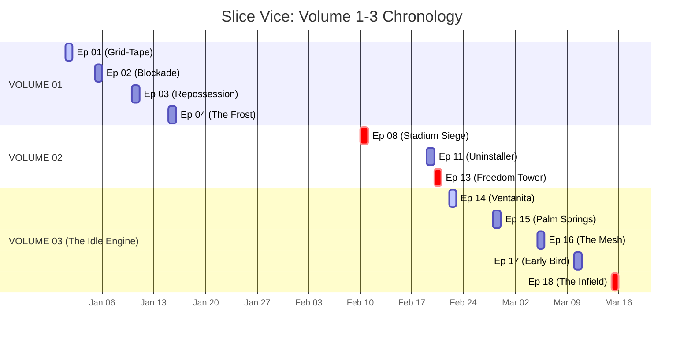
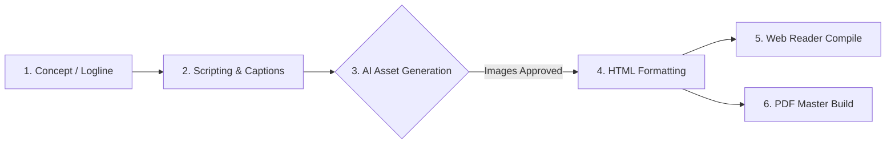

# 🎛️ SLICE VICE: MISSION CONTROL
> **The central nervous system for Slice Vice production, lore tracking, and generation pipelines.**

---

## 📅 THE TIMELINE (1980 HARD GRID)

---

## 🚀 CURRENT SPRINT: Transition to Volume 03

We have concluded **Volume 02 (The Uninstaller)** and are entering **Volume 03 (The Idle Engine)**. It is a pacing-shift arc. The car is broken, Axel is grounded, and the seeds of the Mariel Boatlift are being planted.

### Core Objectives:
- [ ] **Drafting:** Write `EPISODE_14_SHEETS.md` (The Ventanita).
- [ ] **Asset Gen:** Generate visual assets for Ep 14 (Doña Carmen, Versailles, Elio's garage).
- [ ] **Lore Drop:** Finalize dossiers for new Volume 3 anchors (Doña Carmen, Jean-Pierre, Sol Abramowitz).
- [ ] **Tech/Compile:** Formally tag and deploy the complete Volume 02 Master PDF.

---

## 🛠️ THE PRODUCTION PIPELINE

### Quick Commands (When Ready to Fire)
Just tell Antigravity the following whenever you hit these milestones:
1. *"Write the image prompts for Episode 14"*
2. *"Format the Episode 14 HTML panels"*
3. *"Run the PDF compilation script for Volume 2"*

---

## 🗃️ LORE DEBT (Missing/Pending Entries)
These are world-building elements referenced but not fully documented:
- [ ] `DOSSIER_JEAN_PIERRE.md` - Sector H analog relay technician.
- [ ] `DOSSIER_DONA_CARMEN.md` - The anchor at Versailles.
- [ ] `DOSSIER_SOL_ABRAMOWITZ.md` - The anomaly in Hollywood.
- [ ] `THE_MARIEL_SURGE.md` - Expanding the pre-boatlift dynamics in the Straits.
