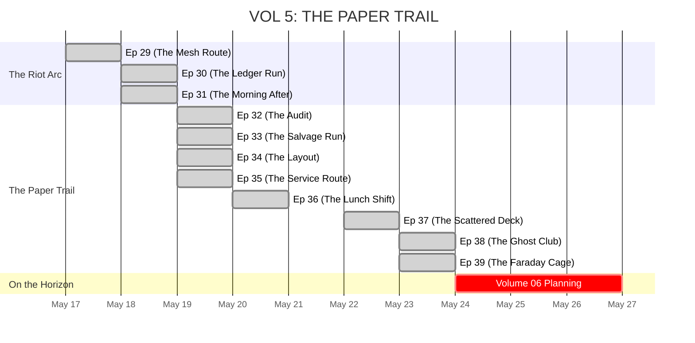

# 🗂️ SLICE VICE: STORY & LORE DASHBOARD  
> **Master Overview:** Tracking Timeline, Character Status, and Arc Progression

---

## 📅 GLOBAL STATE

*   **Current In-Universe Date:** 🟢 May 23, 1980
*   **Active Story Volume:** Volume 05 (The Paper Trail - CLOSED)
*   **Current Episode:** Ep 39 (The Faraday Cage) - VOLUME FINALE
*   **Narrative Objective:** Vanguard has been temporarily stalled after Sol broadcasted their wiretap archive on live pirate radio. The team is safe for now, re-grouping at Elio's garage.

---

## 👥 CHARACTER STATUS BOARD

| Character | Status | Current Location | Active Arc | Dossier Link |
| :--- | :--- | :--- | :--- | :--- |
| **Axel** | Alive | Coconut Grove / Cinema Rouge | Casing the Mutiny Hotel loading dock and consulting blueprints | [AXEL_OFF_GRID](../lore/characters/AXEL_OFF_GRID.md) |
| **Reya** | Active | Cinema Rouge (Booth 14) | Reviewing architectural prints for the Mutiny Hotel | [CHARACTER_REYA](../lore/characters/CHARACTER_REYA.md) |
| **Director Vance** | Active | The Palms Skyscraper | Deploying demolition crews to secure Grid-Spike anchors | [CHARACTER_VANCE](../lore/characters/CHARACTER_VANCE.md) |
| **Mister G** | Active | Sector H (Little Haiti) | Operating the Analog Mesh | [DOSSIER_MISTER_G](../lore/characters/DOSSIER_MISTER_G.md) |
| **"Radio" Maria**| Active | Sector H (Radio Tower) | Broadcasting localized comms | [DOSSIER_RADIO_MARIA](../lore/characters/DOSSIER_RADIO_MARIA.md) |
| **Doña Carmen** | Active | Hialeah (Cousin's House) | Safe from the Riots | [DOSSIER_DONA_CARMEN](../lore/characters/DOSSIER_DONA_CARMEN.md) |
| **Jean-Pierre** | Active | Elio's Garage (SW 8th) | Cross-referencing physical tape and salvaged routing cards | [DOSSIER_JEAN_PIERRE](../lore/characters/DOSSIER_JEAN_PIERRE.md) |
| **Sol Abramowitz**| Active | Elio's Garage (SW 8th) | Decoding structural plans for Vanguard's mid-city Grid network | [DOSSIER_SOL_ABRAMOWITZ](../lore/characters/DOSSIER_SOL_ABRAMOWITZ.md) |

---

## 🛠️ KEY ASSET STATUS

*   **The Grid-Tape:** 📼 **REFORMATTED.** Original constraints removed. It holds the origin sequence of the 1970s land-fills.
*   **The Mesh Archive:** 📻 **RESCUED.** Jean-Pierre's eighteen months of frequency logs, currently sitting in Elio's Garage.
*   **Sol's Notebook:** 📓 **ACQUIRED.** The leather-bound ledger holding Vanguard's manual parcel acquisitions, acquired during the blackout.
*   **Vanguard Routing Cards:** 📇 **OBTAINED.** Six cards pulled from a mid-city lockbox right before demolition.
*   **The '78 LeMans:** 🚘 **OPERATIONAL.** Recently received a full transmission rebuild. Survived the Riot Arc and the blackout drive from Condo Canyon.

---

## 🌍 HISTORICAL EVENTS & LORE ANCHORS
These real-world events have been deeply interconnected with the Slice Vice underground economy.
*   **Jan 29, 1980:** [The McDuffie Indictment](../lore/world/EVENT_MCDUFFIE_INDICTMENT.md) - *The "Grid-Hounds" unleashed during police paranoia.*
*   **Feb 27, 1980:** [The $1.5 Billion Federal Surplus](../lore/world/EVENT_FED_SURPLUS.md) - *Axel's LeMans used as a Faraday cage of illicit currency.*
*   **Mar 17, 1980:** [The Refugee Act of 1980](../lore/world/EVENT_REFUGEE_ACT.md) - *Vance initiates Ghost Protocol ahead of the Mariel Boatlift.*

---

## ⌚ VOLUME 05 TIMELINE SYNC

---

## 🎯 NEXT STEPS FOR AUTHOR
1. Outline the narrative themes and primary antagonist movements for Volume 06.
2. Consider how Vanguard's exposure via Radio Maria will escalate their tactics.
3. Plan the next phase of the UI enhancements for the web reader application.
4. Prepare the final visual asset packaging for Season One.
