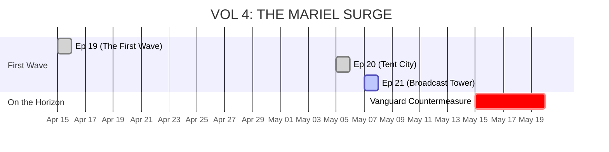

# 🗂️ SLICE VICE: STORY & LORE DASHBOARD  
> **Master Overview:** Tracking Timeline, Character Status, and Arc Progression

---

## 📅 GLOBAL STATE

*   **Current In-Universe Date:** 🟢 May 7, 1980
*   **Active Story Volume:** Volume 04 (The Mariel Surge)
*   **Current Episode:** Ep 21 (The Broadcast Tower) - *Analog Blackout Action Sequence*
*   **Narrative Objective:** Establishing the resistance infrastructure and escalating the conflict with Vanguard over the refugee encampments.

---

## 👥 CHARACTER STATUS BOARD

| Character | Status | Current Location | Active Arc | Dossier Link |
| :--- | :--- | :--- | :--- | :--- |
| **Axel** | Alive | Sector H (Radio Maria's Mast) | Amplifying the Ghost Signal | [AXEL_OFF_GRID](../lore/characters/AXEL_OFF_GRID.md) |
| **Reya** | Active | Stiltsville (?) | Formulating system attacks | [CHARACTER_REYA](../lore/characters/CHARACTER_REYA.md) |
| **Director Vance** | Active | The Palms Skyscraper | Escalating infrastructure war | [CHARACTER_VANCE](../lore/characters/CHARACTER_VANCE.md) |
| **Mister G** | Active | Sector H (Little Haiti) | Operating the Analog Mesh | [DOSSIER_MISTER_G](../lore/characters/DOSSIER_MISTER_G.md) |
| **"Radio" Maria**| Active | Sector H (Radio Tower) | Broadcasting localized comms | [DOSSIER_RADIO_MARIA](../lore/characters/DOSSIER_RADIO_MARIA.md) |
| **Doña Carmen** | Active | Versailles (Little Havana) | Managing Intel / Ventanita Anchor| [DOSSIER_DONA_CARMEN](../lore/characters/DOSSIER_DONA_CARMEN.md) |
| **Jean-Pierre** | Active | Sector H | Monitoring Coast Guard / Straits | [DOSSIER_JEAN_PIERRE](../lore/characters/DOSSIER_JEAN_PIERRE.md) |
| **Sol Abramowitz**| Active | Hollywood, FL | Navigating Condo Canyon / Pre-Mariel | [DOSSIER_SOL_ABRAMOWITZ](../lore/characters/DOSSIER_SOL_ABRAMOWITZ.md) |

---

## 🛠️ KEY ASSET STATUS

*   **The Grid-Tape:** 📼 **REFORMATTED.** Original constraints removed. It holds the origin sequence of the 1970s land-fills.
*   **The '78 LeMans:** 🚘 **OPERATIONAL.** Recently received a full transmission rebuild (Grand Prix donor) and new throttle body (from Dockery Salvage). Strongest it has been since Episode 1. Salt Shield installed.

---

## 🌍 HISTORICAL EVENTS & LORE ANCHORS
These real-world events have been deeply interconnected with the Slice Vice underground economy.
*   **Jan 29, 1980:** [The McDuffie Indictment](../lore/world/EVENT_MCDUFFIE_INDICTMENT.md) - *The "Grid-Hounds" unleashed during police paranoia.*
*   **Feb 27, 1980:** [The $1.5 Billion Federal Surplus](../lore/world/EVENT_FED_SURPLUS.md) - *Axel's LeMans used as a Faraday cage of illicit currency.*
*   **Mar 17, 1980:** [The Refugee Act of 1980](../lore/world/EVENT_REFUGEE_ACT.md) - *Vance initiates Ghost Protocol ahead of the Mariel Boatlift.*

---

## ⌚ VOLUME 04 TIMELINE SYNC

---

## 🎯 NEXT STEPS FOR AUTHOR
1. Generate image assets for Episode 21 keyframes using the new script.
2. Compile and review EP21 visual fidelity.
3. Update `SEASON_ONE_CHRONOLOGY.md` to document the Volume 04 events.
